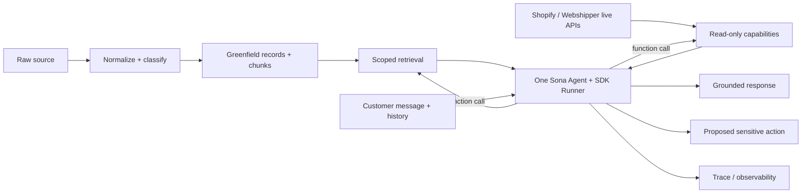

# Sona greenfield support-agent experiment

Status: architecture checkpoint and first vertical slice, 2026-09-03

This experiment is isolated on `experiment/greenfield-support-agent`, created from
`origin/staging` at `e4a866b9f0c9dd7a9de30e042e46c521557fcbd4`. It is not deployed,
merged, or connected to production mutations.

## Goal

Test whether Sona can get a simpler, more inspectable support core from a small
model/tool loop backed by typed tenant-scoped knowledge and live read-only
commerce/shipping capabilities. The initial benchmark is a tenant-neutral,
fixed support set plus deterministic contract tests. V2 may be added later as a
separate candidate; V3 is intentionally not a dependency or initial baseline.

## Reference patterns used

The [OpenAI Agents SDK for TypeScript](https://github.com/openai/openai-agents-js)
is the primary runtime candidate. Its [Agents guide](https://openai.github.io/openai-agents-js/guides/agents/),
[function tools](https://openai.github.io/openai-agents-js/guides/tools/),
[human-in-the-loop](https://openai.github.io/openai-agents-js/guides/human-in-the-loop/),
and [tracing](https://openai.github.io/openai-agents-js/guides/tracing/)
primitives map directly to this experiment: one `Agent`, one `Runner`, typed
tools, resumable approval state, and trace spans. Sona does not use handoffs,
agents-as-tools, sessions, hosted file search, or programmatic tool calling in
this first slice because there is no measured need for them.

The [OpenAI support-agent demo](https://github.com/openai/openai-support-agent-demo)
was studied as a secondary reference for customer-support interaction patterns,
sequential tool results, file/knowledge search, and sensitive action handling.
Its demo data, vector-store setup, frontend, and placeholder mutation functions
are not copied. Sona's tenant isolation and server-side integration context take
precedence over both references.

## Architecture

There is no intent classifier, evidence package, response-directive layer,
repair pipeline, case router, or writer pipeline in this core.

## Knowledge architecture

Knowledge is a normalized record with a required `workspace_id`, a knowledge
type, authority, source identity, source label/URI, content hash, timestamps,
optional structured fields, and chunks. The new SQL tables are deliberately
named `greenfield_knowledge_*`; they do not reuse `agent_knowledge`,
`ticket_examples`, or V2/V3 retrieval RPCs.

Supported types:

| Type | Treatment |
| --- | --- |
| `policy` | Authoritative business rules; outranks examples. |
| `product` | Product facts, compatibility, manuals, and troubleshooting. |
| `live_operational` | A cache/snapshot type only; agent retrieval excludes it by default. Current facts come from live tools. |
| `historic_support` | Solved tickets/replies used as examples, never automatic policy. |
| `brand` | Tone, terminology, language, and response guidance. |
| `procedural` | Required information and operational handling steps. |

The ingestion path is:

`raw source → normalize → classify → structured extraction → hash/deduplicate → attach trusted workspace → retain provenance/timestamps → chunk → store/index`.

The first implementation has deterministic lexical/structured retrieval in
memory and a Supabase RPC adapter using PostgreSQL full-text ranking. Retrieval
is always filtered by workspace before ranking, and expired records are
excluded. Authority and freshness affect ranking.

The retrieval bake-off added a nullable `embedding` column, a greenfield-only
HNSW index, and a greenfield-only semantic RPC in a follow-up migration. This
was added because real-data lexical retrieval failed natural-language support
queries. The support-agent response path now uses that semantic RPC directly
for the existing cleaned greenfield chunks. The lexical RPC remains available
as a baseline; hybrid ranking is not part of the runtime path.

## Agent loop

1. The server supplies a trusted workspace and integration context.
2. One OpenAI Agents SDK `Agent` receives the short developer instructions,
   conversation history, the current customer message, and strict capability
   definitions.
3. If it needs information, the SDK runner admits one function call at a time.
4. The deterministic registry validates arguments and executes only read-only capabilities, or
   returns a structured proposed action for sensitive capabilities.
5. The SDK appends the tool result and continues the same agent run.
6. The agent may call another capability or return the final customer response.
7. `withTrace()` and the returned run items provide runtime observability; the
   experiment also returns a small Sona trace with provenance and failures.

The SDK loop is bounded to 12 turns, with the default at 8. Proposal-only tools
do not mutate anything and therefore do not pause the current reply for human
approval. If a real write is introduced later, it must be added behind the
registry and exposed with the SDK's `needsApproval`/`RunState` flow; the route
must persist and resume that state rather than auto-approving it. A safe
fallback is returned on model/tool failure or turn exhaustion.

## Capability architecture

Knowledge capabilities: `search_policy`, `search_product_knowledge`,
`search_historical_cases`, `get_brand_guidance`, `get_procedure`.

Live read-only capabilities: `get_order`, `get_order_history`, `get_customer`,
`get_product`, `inspect_fulfillment`, `get_tracking`.

Sensitive capabilities are proposal-only: `cancel_order`, `update_address`,
`create_return`, `create_refund`, and `send_replacement`. Their implementations
do not call a provider. They return `{ status: "proposed", proposedAction: ...,
requiresConfirmation: true }`, and the agent adds a status-honesty reminder to
the customer response if needed.

## Tenant and security model

`TenantContext` is created server-side from the authenticated Clerk workspace
and scoped shop. Tool schemas contain only business arguments. They do not
contain `tenant_id`, `workspace_id`, `shop_id`, credentials, or authorization
scope. Runtime validation rejects those keys even if a model sends them.

The Next route resolves one unambiguous Shopify shop inside the authenticated
workspace; it does not accept a shop ID from the request. Shopify credentials
are resolved server-side and are never put into model input or trace data. The
new SQL tables require a non-null workspace and include RLS membership checks.

The route only reads an optional thread's customer identity server-side. It does
not accept customer identity from the model or execute customer/order writes.

## Observability

Each run records the customer message, history, developer instructions,
available capabilities, SDK run item types, tool calls and arguments, knowledge
results with provenance/authority/freshness, tool results, proposed actions,
final response, errors, fallback state, per-call latency, and model usage when
supplied. The SDK runner is configured with sensitive-data capture disabled for
its exported traces; the Sona trace is returned from the experiment route for
inspection. Credentials are never recorded.

## Initial evaluation

`supabase/eval/greenfield-support-cases.json` contains 17 tenant-neutral cases:
WISMO, order status, tracking, delay, return policy/request, cancellation,
address change, damaged item, replacement, refund question/request, product,
compatibility, warranty, missing information, ambiguity, and multi-intent.

The offline contract baseline validates retrieval, live read-only lookup, strict
tool contracts, proposal-only action behavior, and trace completeness. The SDK
runtime is exercised with its official scripted model test double, but this is
not presented as an LLM quality score. A later development run can use
`OPENAI_API_KEY` against the same raw cases; the harness does not feed a V2 or
V3 answer/context into greenfield.

## Reuse boundary

Allowed reuse is limited to the Next.js app shell, Clerk/Supabase auth and
workspace scope resolution, server-side Shopify credential resolution, and the
low-level Shopify HTTP convention. The greenfield core owns its own knowledge
records, retrieval contract, tool definitions, agent loop, response safety, and
trace model.

Intentionally bypassed: V2/V3 draft generation, V2/V3 retrieval and knowledge
schemas, EvidencePackage/context assembly, response directives, intent routing,
repair stages, case rules, writer pipelines, and V3 orchestration.

## Safety state at checkpoint

The original staging worktree was already dirty before this experiment in four
inbox UI files; those changes were not touched. The V3 worktrees were observed
clean. The experiment worktree started clean at the recorded staging SHA. No
deployment, merge, cherry-pick, production write, real email, refund,
cancellation, return, replacement, address update, or customer-data mutation
has been performed.
